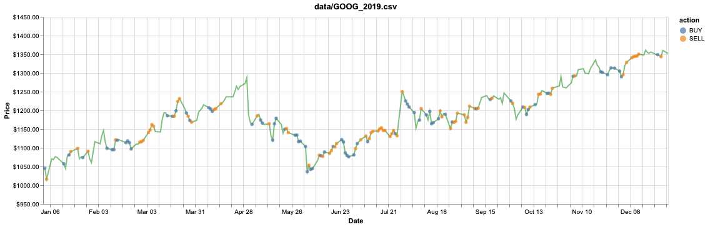
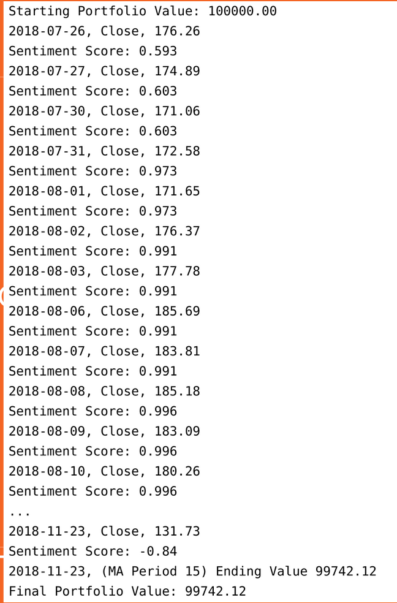
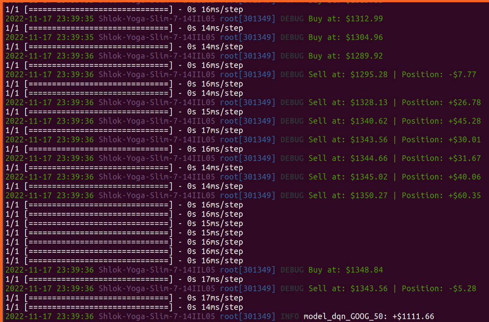

# Stock-Trading-Bot
IT302 Project
We Implement a real time trading bot which buys and sells according to the sentiments of the market. The bot is trained on GOOG 2010-17 stock data, tested on 2019 with a profit of $1141.45 (validated on 2018 with profit of $863.41): 

Inspiration: https://towardsdatascience.com/https-towardsdatascience-com-algorithmic-trading-using-sentiment-analysis-on-news-articles-83db77966704

Execute run.txt for Techincal Analysis and StockSentimentTrading for Sentimental Analysis.

## Results:

#### The left side shows only sentimental analysis and the right shows both technial and sentimental analysis where we use Deep Q learning.
#### The top screenshot shows the final output visualised to get the profit of $1141.45
